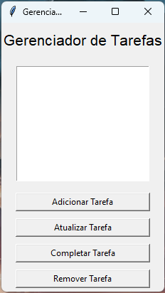
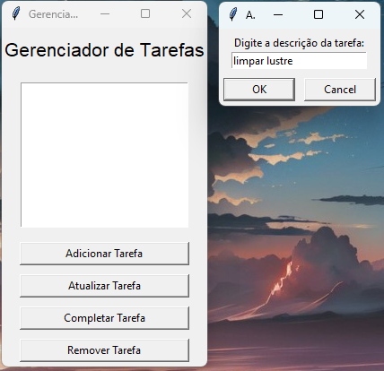
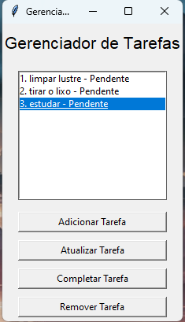
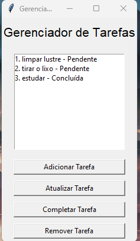

# Gerenciador de Tarefas (To-Do List) com Tkinter

## Visão Geral

O Gerenciador de Tarefas é uma aplicação Python que oferece uma solução prática e interativa para organizar suas tarefas diárias. Com uma interface gráfica simples, você pode adicionar, visualizar, atualizar e remover tarefas de forma eficiente.

## Recursos Principais

### Adicionar Tarefas
- Insira a descrição da tarefa desejada.
- Clique em "Adicionar Tarefa" para incluí-la na lista.

### Visualizar Tarefas
- Visualize todas as tarefas registradas.
- As tarefas concluídas são destacadas para fácil identificação.
- A lista é atualizada em tempo real à medida que você adiciona, atualiza, completa ou remove tarefas.

### Atualizar Tarefas
- Selecione uma tarefa na lista.
- Atualize a descrição ou o status (concluída/pendente) da tarefa.
- Clique em "Atualizar Tarefa" para salvar as alterações.

### Remover Tarefas
- Escolha uma tarefa na lista.
- Clique em "Remover Tarefa" para excluí-la da lista.

### Persistência de Dados
- Todas as tarefas são salvas automaticamente em um arquivo JSON (`tasks.json`) para que você possa retomar o trabalho a qualquer momento.

## Como Usar

1. Clone este repositório para sua máquina local.

2. Verifique se você tem a biblioteca Tkinter instalada em seu ambiente Python. A maioria das instalações padrão do Python já inclui o Tkinter.

3. Execute o programa Python com o seguinte comando:

   `python todo.py`

5. Use a interface gráfica para gerenciar suas tarefas. Adicione, visualize, atualize ou remova tarefas com facilidade.

## Capturas de Tela

   

## Contribuições

Contribuições são bem-vindas! Se você tiver sugestões de recursos adicionais, correções de bugs ou melhorias na interface, sinta-se à vontade para criar um fork deste repositório, fazer as alterações necessárias e enviar um pull request.

## Autor

Merlin Ribeiro

